# 🏗️ Project Architecture — `task1-recaptcha-stealth`

> A stealth reCAPTCHA v3 automation system built on Playwright + CDP, featuring
> real fingerprint replay, human behavior simulation, and async parallel execution.

---

## Table of Contents

1. [High-Level Overview](#1-high-level-overview)
2. [Directory Structure](#2-directory-structure)
3. [File Dependency Graph](#3-file-dependency-graph)
4. [Layered Architecture](#4-layered-architecture)
5. [Core Module Breakdown](#5-core-module-breakdown)
6. [Execution Modes](#6-execution-modes)
7. [Data Flow](#7-data-flow)
8. [Configuration System](#8-configuration-system)
9. [Helpers vs Root `src/` Modules](#9-helpers-vs-root-src-modules)

---

## 1. High-Level Overview

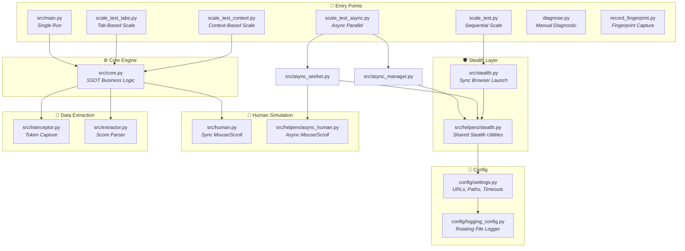

The system is designed around a **Single Source of Truth (SSOT)** pattern: `src/core.py` contains the core reCAPTCHA solving logic, and multiple entry points (runners) wrap that logic with different execution strategies (single, sequential, tab-based, context-based, async parallel).

---

## 2. Directory Structure

```
task1-recaptcha-stealth/
│
├── config/                          # 🔧 Configuration Layer
│   ├── __init__.py                  #    Package marker
│   ├── settings.py                  #    Global constants (URLs, paths, timeouts)
│   └── logging_config.py            #    Rotating file + console logger
│
├── src/                             # ⚙️ Application Source Code
│   ├── __init__.py                  #    Exports: run()
│   ├── __main__.py                  #    `python -m src` entry point
│   ├── main.py                      #    Single-run entry point with CLI args
│   ├── core.py                      #    ★ SSOT: solve_recaptcha() orchestrator
│   ├── stealth.py                   #    Sync stealth browser launcher (CDP)
│   ├── human.py                     #    Sync human behavior simulation
│   ├── async_human.py               #    Async human behavior simulation
│   ├── interceptor.py               #    Token capture via route interception
│   ├── extractor.py                 #    JSON response parser
│   ├── async_manager.py             #    Async browser lifecycle (Singleton)
│   ├── async_worker.py              #    Async per-iteration test worker
│   │
│   └── helpers/                     # 🧩 Shared Utility Modules (used by async path)
│       ├── __init__.py              #    Package marker
│       ├── stealth.py               #    Stealth utilities (shared by sync + async)
│       ├── human.py                 #    Sync human behavior (mirror of src/human.py)
│       ├── async_human.py           #    Async human behavior (mirror of src/async_human.py)
│       ├── interceptor.py           #    Token interceptor (mirror of src/interceptor.py)
│       ├── extractor.py             #    Score extractor (mirror of src/extractor.py)
│       └── outputs/                 #    (Reserved for helper-specific outputs)
│
├── outputs/                         # 📊 Runtime Outputs
│   ├── fingerprint.json             #    Recorded real browser fingerprint
│   ├── automation.log               #    Rotating log file
│   ├── results_async.json           #    Async test results
│   └── result_single_*.json         #    Individual single-run results
│
├── docs/                            # 📚 Documentation
│   ├── architecture.md              #    ★ This file
│   ├── stealth_strategy.md          #    Stealth techniques documentation
│   ├── Q1-score-parameters.md       #    reCAPTCHA scoring parameter analysis
│   ├── Q2-research.md               #    Research notes
│   └── step2-extraction.md          #    Data extraction documentation
│
├── .chrome_profile/                 # 🌐 Persistent Chrome user profile (gitignored)
├── .venv/                           # 🐍 Python virtual environment
│
├── record_fingerprint.py            # 🔍 Standalone: captures real browser fingerprint
├── scale_test.py                    # 🔁 Sequential scaled test runner
├── scale_test_tabs.py               # 🔁 Tab-based scaled test runner
├── scale_test_context.py            # 🔁 Context-based scaled test runner
├── scale_test_async.py              # ⚡ Async parallel test runner
├── diagnose.py                      # 🩺 Manual diagnostic tool
├── proxies.txt                      # 🔒 Proxy server list
├── requirements.txt                 # 📦 Python dependencies
└── README.md                        # 📖 Project overview
```

---

## 3. File Dependency Graph

### 3.1 — Sync Execution Path (Single Run)

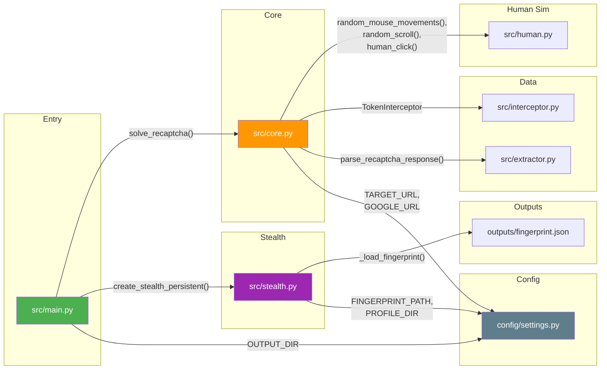

### 3.2 — Async Execution Path (Parallel)

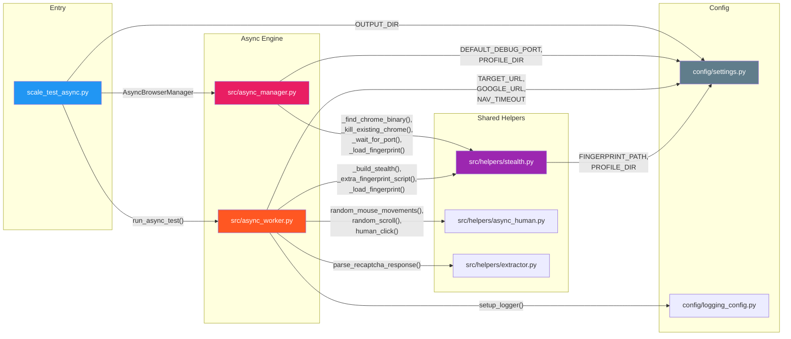

### 3.3 — Scale Test Runners Dependency Comparison

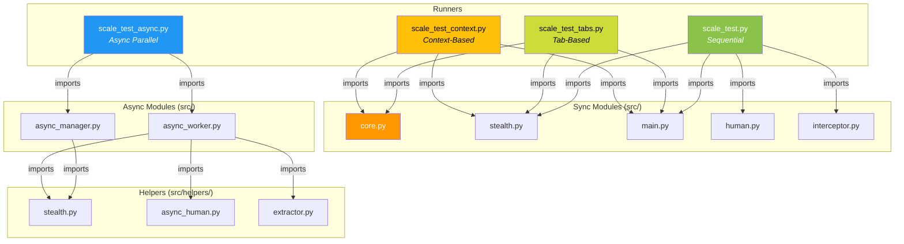

### 3.4 — Complete Import Map (All Files)

The following table shows every file and its exact imports from within the project:

| **File**                     | **Imports From**                                                                                                                                                                                                                                                                                                                                                   |
| ---------------------------- | ------------------------------------------------------------------------------------------------------------------------------------------------------------------------------------------------------------------------------------------------------------------------------------------------------------------------------------------------------------------ |
| `src/__init__.py`            | `src/main.py` → `run`                                                                                                                                                                                                                                                                                                                                              |
| `src/__main__.py`            | `src/main.py` → `main`                                                                                                                                                                                                                                                                                                                                             |
| `src/main.py`                | `config/settings.py` → `OUTPUT_DIR`; `src/core.py` → `solve_recaptcha`; `src/stealth.py` → `create_stealth_persistent`                                                                                                                                                                                                                                             |
| `src/core.py`                | `config/settings.py` → `GOOGLE_URL, TARGET_URL`; `src/human.py` → `random_mouse_movements, random_scroll, human_click`; `src/interceptor.py` → `TokenInterceptor`; `src/extractor.py` → `parse_recaptcha_response`                                                                                                                                                 |
| `src/stealth.py`             | `config/settings.py` (via inline paths); `outputs/fingerprint.json` (file read)                                                                                                                                                                                                                                                                                    |
| `src/human.py`               | _(no project imports — only `playwright`, `random`, `time`)_                                                                                                                                                                                                                                                                                                       |
| `src/async_human.py`         | _(no project imports — only `playwright`, `random`)_                                                                                                                                                                                                                                                                                                               |
| `src/interceptor.py`         | _(no project imports — only `re`, `playwright`)_                                                                                                                                                                                                                                                                                                                   |
| `src/extractor.py`           | _(no project imports — only `json`)_                                                                                                                                                                                                                                                                                                                               |
| `src/async_manager.py`       | `config/settings.py` → `DEFAULT_DEBUG_PORT, PROFILE_DIR`; `src/helpers/stealth.py` → `_find_chrome_binary, _kill_existing_chrome, _wait_for_port, _load_fingerprint`                                                                                                                                                                                               |
| `src/async_worker.py`        | `config/settings.py` → `TARGET_URL, GOOGLE_URL, NAV_TIMEOUT, WARMUP_TIMEOUT`; `config/logging_config.py` → `setup_logger`; `src/helpers/stealth.py` → `_build_stealth, _extra_fingerprint_script, _load_fingerprint`; `src/helpers/async_human.py` → `random_mouse_movements, random_scroll, human_click`; `src/helpers/extractor.py` → `parse_recaptcha_response` |
| `src/helpers/stealth.py`     | `config/settings.py` → `FINGERPRINT_PATH, PROFILE_DIR`                                                                                                                                                                                                                                                                                                             |
| `src/helpers/human.py`       | _(no project imports)_                                                                                                                                                                                                                                                                                                                                             |
| `src/helpers/async_human.py` | _(no project imports)_                                                                                                                                                                                                                                                                                                                                             |
| `src/helpers/interceptor.py` | _(no project imports)_                                                                                                                                                                                                                                                                                                                                             |
| `src/helpers/extractor.py`   | _(no project imports)_                                                                                                                                                                                                                                                                                                                                             |
| `scale_test.py`              | `src/main.py` → `TARGET_URL, OUTPUT_DIR, parse_recaptcha_response`; `src/stealth.py` → `create_stealth_persistent`; `src/interceptor.py` → `TokenInterceptor`; `src/human.py` → `random_mouse_movements, random_scroll, human_click`                                                                                                                               |
| `scale_test_tabs.py`         | `src/core.py` → `solve_recaptcha`; `src/stealth.py` → `create_stealth_persistent`; `src/main.py` → `OUTPUT_DIR, parse_recaptcha_response`                                                                                                                                                                                                                          |
| `scale_test_context.py`      | `src/core.py` → `solve_recaptcha`; `src/stealth.py` → `create_stealth_persistent, _load_fingerprint, _build_stealth, _extra_fingerprint_script`; `src/main.py` → `OUTPUT_DIR`                                                                                                                                                                                      |
| `scale_test_async.py`        | `config/settings.py` → `OUTPUT_DIR, CONCURRENCY_LIMIT`; `src/async_manager.py` → `AsyncBrowserManager`; `src/async_worker.py` → `run_async_test`                                                                                                                                                                                                                   |
| `diagnose.py`                | _(standalone — uses `playwright` and `playwright_stealth` directly)_                                                                                                                                                                                                                                                                                               |
| `record_fingerprint.py`      | _(standalone — built-in `http.server`, writes to `outputs/`)_                                                                                                                                                                                                                                                                                                      |
| `config/logging_config.py`   | `config/settings.py` → `OUTPUT_DIR, PROJECT_ROOT`                                                                                                                                                                                                                                                                                                                  |

---

## 4. Layered Architecture

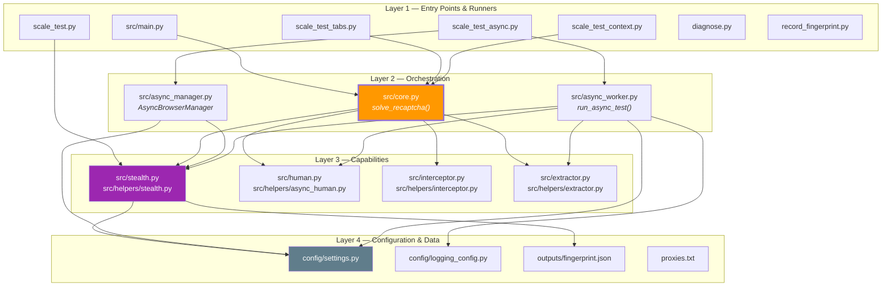

| Layer                       | Responsibility                                                                                                                       | Key Principle                                                                 |
| --------------------------- | ------------------------------------------------------------------------------------------------------------------------------------ | ----------------------------------------------------------------------------- |
| **Layer 1 — Entry Points**  | User-facing CLI tools. Choose how to run (single, scale, async).                                                                     | No business logic — just orchestration wrappers.                              |
| **Layer 2 — Orchestration** | `core.py` is the SSOT for the solve flow. `async_manager.py` manages browser lifecycle. `async_worker.py` executes async iterations. | All test logic lives here; runners delegate to this layer.                    |
| **Layer 3 — Capabilities**  | Stealth browser launch, human simulation, token interception, JSON parsing.                                                          | Pure, focused modules. No knowledge of test flow.                             |
| **Layer 4 — Configuration** | Centralized constants, paths, logger setup, fingerprint data.                                                                        | Single source of truth for all settings; no hardcoded values in upper layers. |

---

## 5. Core Module Breakdown

### 5.1 `src/core.py` — The SSOT Orchestrator

This is the **most important file** in the project. It defines the canonical reCAPTCHA solving flow that all runners call:

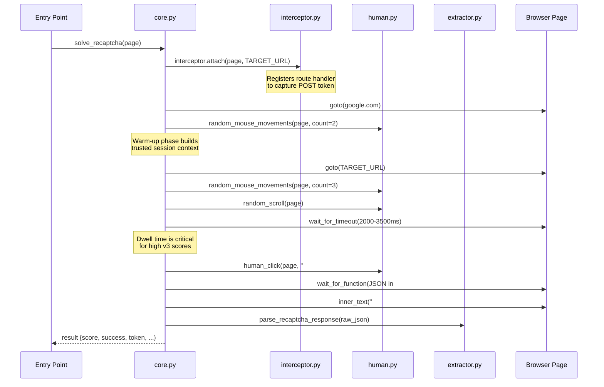

### 5.2 `src/stealth.py` — Browser Launch Pipeline

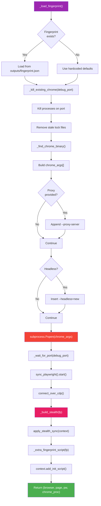

### 5.3 `src/async_manager.py` — Singleton Browser Manager

```mermaid
classDiagram
    class AsyncBrowserManager {
        -_instance: AsyncBrowserManager
        -initialized: bool
        +browser: Browser
        +playwright: Playwright
        +chrome_proc: Popen
        +debug_port: int
        +fingerprint: dict
        +__new__() AsyncBrowserManager
        +start(headless, proxy_url) Browser
        +stop()
        -_create_proxy_auth_extension(proxy_url) str
    }

    class AsyncScaler {
        +count: int
        +concurrency: int
        +results: list
        +semaphore: Semaphore
        +browser_manager: AsyncBrowserManager
        +run()
        -_worker(iteration) dict
        -_load_proxies() list
        -_validate_proxy(proxy) bool
    }

    AsyncScaler --> AsyncBrowserManager : uses
    AsyncBrowserManager --> "src/helpers/stealth" : delegates to

    note for AsyncBrowserManager "Singleton Pattern:<br/>Only one Chrome process<br/>shared across all workers"
```

---

## 6. Execution Modes

The project supports **5 distinct execution modes**, each optimized for a different use case:

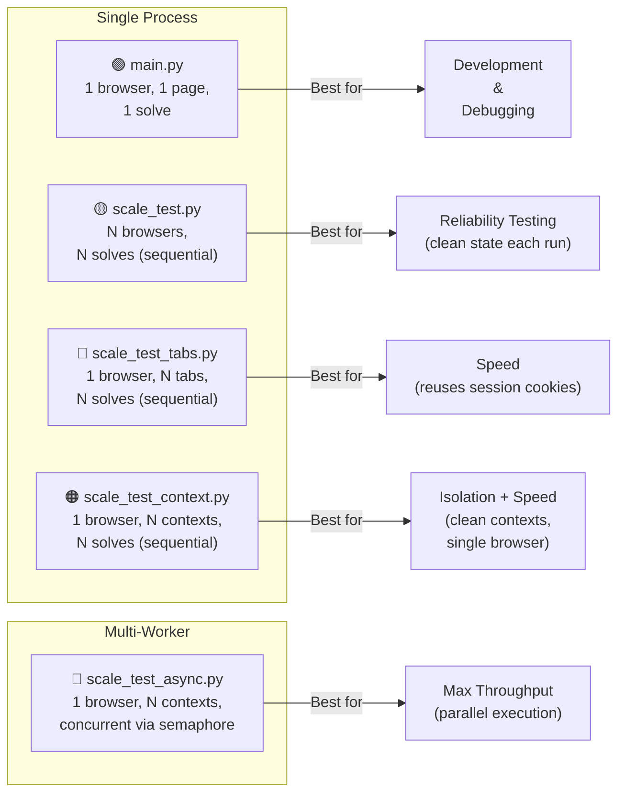

| Mode              | File                    | Browser Instances | Strategy                           | Isolation                |
| ----------------- | ----------------------- | :---------------: | ---------------------------------- | ------------------------ |
| **Single**        | `main.py`               |         1         | One-shot run                       | Full                     |
| **Sequential**    | `scale_test.py`         | N (new each run)  | Launch → Solve → Kill → Repeat     | Full (slow)              |
| **Tab-Based**     | `scale_test_tabs.py`    |         1         | Reuse browser, cycle tabs          | Partial (shared cookies) |
| **Context-Based** | `scale_test_context.py` |         1         | Reuse browser, fresh contexts      | High (incognito-like)    |
| **Async**         | `scale_test_async.py`   |         1         | Concurrent contexts with semaphore | High + parallel          |

---

## 7. Data Flow

### 7.1 — Fingerprint Recording & Replay

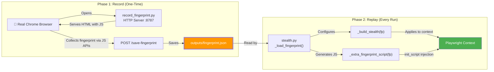

### 7.2 — Token Capture & Score Extraction

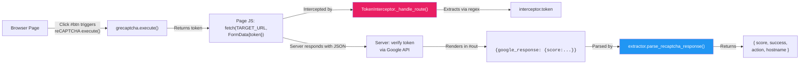

### 7.3 — Output File Generation

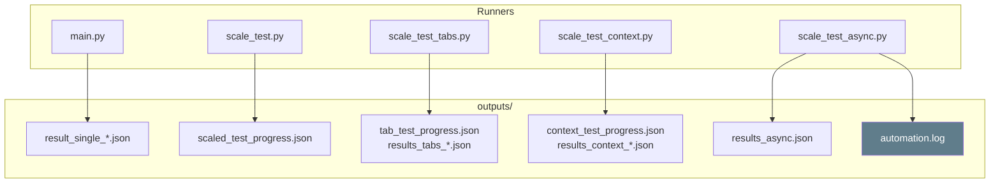

---

## 8. Configuration System

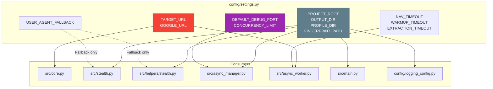

All configuration values are **centralized** in `config/settings.py`. No module hardcodes URLs, paths, or timeouts. This makes the system easily configurable for different environments or target sites.

---

## 9. Helpers vs Root `src/` Modules

The project has **two copies** of several modules — one in `src/` and one in `src/helpers/`. This is a deliberate architectural choice:

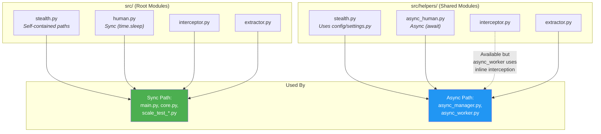

| Aspect                | `src/` Root Modules                    | `src/helpers/` Modules                     |
| --------------------- | -------------------------------------- | ------------------------------------------ |
| **Path resolution**   | Uses `os.path` relative to `__file__`  | Uses `config/settings.py` constants        |
| **Async support**     | Sync only (`time.sleep()`)             | Both sync and async (`await`)              |
| **Primary consumers** | `main.py`, `core.py`, `scale_test*.py` | `async_manager.py`, `async_worker.py`      |
| **Design intent**     | Original modules for the sync pipeline | Refactored for the async/parallel pipeline |

> **Note:** `src/helpers/human.py` and `src/helpers/interceptor.py` are mirrors of their `src/` counterparts (identical code). `src/helpers/stealth.py` differs in that it imports paths from `config/settings.py` instead of computing them inline. `src/helpers/async_human.py` is a fully async version of `src/human.py`.
