# 🛡️ Stealth Strategy — Implemented Techniques

> A deep dive into every anti-detection technique implemented in `task1-recaptcha-stealth`,
> explaining **what** each technique does, **why** it matters for reCAPTCHA v3 scoring,
> and **where** it is implemented in the codebase.

---

## Table of Contents

1. [Threat Model: What reCAPTCHA v3 Detects](#1-threat-model-what-recaptcha-v3-detects)
2. [Strategy Overview](#2-strategy-overview)
3. [Technique 1: Real Chrome via CDP (No Automation Flags)](#3-technique-1-real-chrome-via-cdp-no-automation-flags)
4. [Technique 2: Real Browser Fingerprint Replay](#4-technique-2-real-browser-fingerprint-replay)
5. [Technique 3: playwright-stealth Patches](#5-technique-3-playwright-stealth-patches)
6. [Technique 4: Extended Fingerprint Injection (JavaScript)](#6-technique-4-extended-fingerprint-injection-javascript)
7. [Technique 5: Human Behavior Simulation](#7-technique-5-human-behavior-simulation)
8. [Technique 6: Google Warm-Up (Trust Signal Building)](#8-technique-6-google-warm-up-trust-signal-building)
9. [Technique 7: Persistent Chrome Profile](#9-technique-7-persistent-chrome-profile)
10. [Technique 8: Token Interception via Route Handling](#10-technique-8-token-interception-via-route-handling)
11. [Technique 9: Proxy Support with Auth Extension](#11-technique-9-proxy-support-with-auth-extension)
12. [Technique 10: Process Lifecycle Hygiene](#12-technique-10-process-lifecycle-hygiene)
13. [Technique Stack Diagram](#13-technique-stack-diagram)
14. [Score Impact Analysis](#14-score-impact-analysis)

---

## 1. Threat Model: What reCAPTCHA v3 Detects

reCAPTCHA v3 is a **behavioral scoring engine** — it does not present challenges. Instead, it silently monitors the user's session and assigns a score from `0.0` (bot) to `1.0` (human) based on multiple signals:

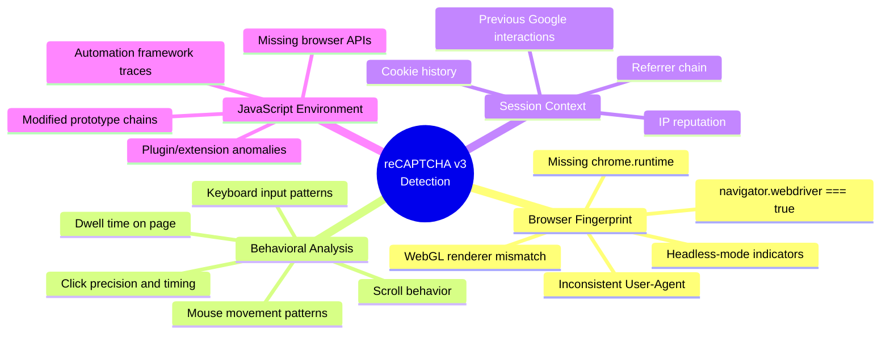

Our stealth strategy addresses **every category** in this threat model.

---

## 2. Strategy Overview

The system implements a **defense-in-depth** approach with 10 distinct techniques layered across 4 categories:

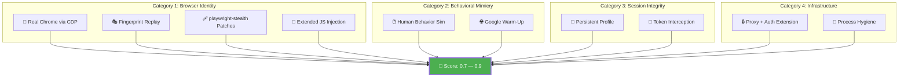

---

## 3. Technique 1: Real Chrome via CDP (No Automation Flags)

### What It Does

Instead of using Playwright's built-in browser launch (which adds `--enable-automation` and other flags), the system launches a **real system-installed Chrome binary** via `subprocess.Popen`, then connects to it using the **Chrome DevTools Protocol (CDP)**.

### Why It Matters

When Playwright launches Chrome normally, it adds several automation flags:

- `--enable-automation` — Tells websites the browser is automated
- `--disable-background-networking` — Breaks normal browser behavior
- `--enable-blink-features=IdleDetection` — Automation-specific feature

These flags are trivially detectable by reCAPTCHA.

### How It's Implemented

**File:** `src/stealth.py` → `create_stealth_persistent()` (lines 182–265)  
**File:** `src/helpers/stealth.py` → `create_stealth_persistent()` (lines 180–265)

```python
# 1. Launch real Chrome — NO automation flags
chrome_args = [
    chrome_binary,
    f"--remote-debugging-port={debug_port}",
    f"--user-data-dir={PROFILE_DIR}",
    "--no-first-run",
    "--no-default-browser-check",
    "--disable-infobars",
    "--disable-dev-shm-usage",
    "about:blank",
]

chrome_process = subprocess.Popen(
    chrome_args,
    stdout=subprocess.DEVNULL,
    stderr=subprocess.DEVNULL,
)

# 2. Connect Playwright to the ALREADY RUNNING Chrome via CDP
pw = sync_playwright().start()
browser = pw.chromium.connect_over_cdp(f"http://127.0.0.1:{debug_port}")
```

### Key Design Decisions

| Decision                                             | Rationale                                                      |
| ---------------------------------------------------- | -------------------------------------------------------------- |
| `subprocess.Popen` instead of `pw.chromium.launch()` | Avoids Playwright injecting automation flags                   |
| `stdout=DEVNULL, stderr=DEVNULL`                     | Prevents pipe buffer blocking on long runs                     |
| `--no-first-run`                                     | Suppresses "Welcome to Chrome" dialogs                         |
| `--disable-infobars`                                 | Removes "Chrome is being controlled by automated software" bar |
| `about:blank` as initial URL                         | Fast startup, no network requests before stealth is applied    |

### Detection It Bypasses

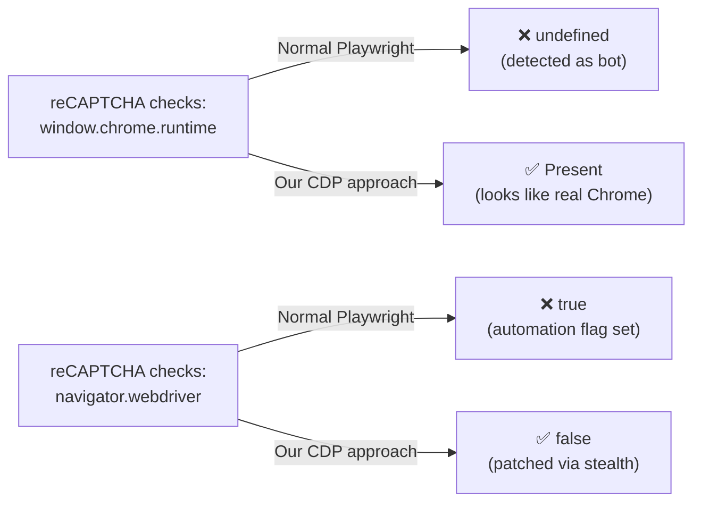

---

## 4. Technique 2: Real Browser Fingerprint Replay

### What It Does

Captures the **exact fingerprint** of a real user's browser session (User-Agent, screen resolution, WebGL renderer, hardware specs, timezone, etc.) and replays it during automated sessions, creating an internally consistent browser identity.

### Why It Matters

reCAPTCHA checks for **fingerprint consistency**. If the User-Agent says "Chrome 144 on Linux" but the WebGL renderer reports a Windows GPU, or `hardwareConcurrency` doesn't match the claimed platform, the session is flagged as suspicious.

### How It's Implemented

#### Phase 1: Recording (One-Time Setup)

**File:** `record_fingerprint.py`

A local HTTP server (port 8787) serves a page that collects the user's real fingerprint via JavaScript APIs:

```javascript
// Collected properties (excerpt from record_fingerprint.py)
fp.userAgent = navigator.userAgent;
fp.platform = navigator.platform;
fp.hardwareConcurrency = navigator.hardwareConcurrency;
fp.deviceMemory = navigator.deviceMemory;
fp.maxTouchPoints = navigator.maxTouchPoints;
fp.screen = { width, height, colorDepth, pixelDepth, ... };
fp.webgl = { vendor, renderer, version, ... };  // GPU fingerprint
fp.languages = Array.from(navigator.languages);
fp.timezone = Intl.DateTimeFormat().resolvedOptions().timeZone;
fp.plugins = [...];  // PDF viewers, etc.
fp.connection = { effectiveType, downlink, rtt };
fp.permissions = { geolocation, notifications, camera, microphone };
```

The fingerprint is saved to `outputs/fingerprint.json`.

#### Phase 2: Replay (Every Run)

**File:** `src/stealth.py` → `_load_fingerprint()`, `_build_stealth()`, `_build_context_options()`, `_extra_fingerprint_script()`  
**File:** `src/helpers/stealth.py` → same functions

The fingerprint is loaded (cached via `@lru_cache`) and applied at multiple levels:

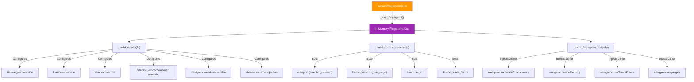

### Properties Replayed

| Property                         | Source in fingerprint.json     | Applied Via                            |
| -------------------------------- | ------------------------------ | -------------------------------------- |
| `navigator.userAgent`            | `userAgent`                    | `playwright-stealth` + context options |
| `navigator.platform`             | `platform`                     | `playwright-stealth`                   |
| `navigator.vendor`               | `vendor`                       | `playwright-stealth`                   |
| `navigator.hardwareConcurrency`  | `hardwareConcurrency`          | JS `Object.defineProperty()` injection |
| `navigator.deviceMemory`         | `deviceMemory`                 | JS `Object.defineProperty()` injection |
| `navigator.maxTouchPoints`       | `maxTouchPoints`               | JS `Object.defineProperty()` injection |
| `navigator.languages`            | `languages`                    | JS `Object.defineProperty()` injection |
| `screen.width / height`          | `screen.width, screen.height`  | Playwright context viewport/screen     |
| `window.devicePixelRatio`        | `devicePixelRatio`             | Playwright `device_scale_factor`       |
| `Intl.DateTimeFormat().timeZone` | `timezone`                     | Playwright `timezone_id`               |
| WebGL vendor/renderer            | `webgl.vendor, webgl.renderer` | `playwright-stealth` WebGL override    |

---

## 5. Technique 3: playwright-stealth Patches

### What It Does

The `playwright-stealth` library applies a set of known patches to make Playwright-controlled browsers undetectable by common bot detection scripts.

### Why It Matters

Even with CDP connection (Technique 1), there are still JavaScript-level artifacts that reveal automation. `playwright-stealth` patches these across the entire browsing context.

### How It's Implemented

**File:** `src/stealth.py` → `_build_stealth()` (lines 33–49)

```python
def _build_stealth(fp: dict | None) -> Stealth:
    kwargs = {
        "chrome_runtime": True,           # Inject window.chrome.runtime
        "navigator_webdriver": True,       # Patch navigator.webdriver → false
    }

    if fp:
        kwargs["navigator_user_agent_override"] = fp.get("userAgent")
        kwargs["navigator_platform_override"] = fp.get("platform")
        kwargs["navigator_vendor_override"] = fp.get("vendor")

        if fp.get("webgl"):
            kwargs["webgl_vendor_override"] = fp["webgl"].get("vendor")
            kwargs["webgl_renderer_override"] = fp["webgl"].get("renderer")

    return Stealth(**kwargs)
```

### Patches Applied

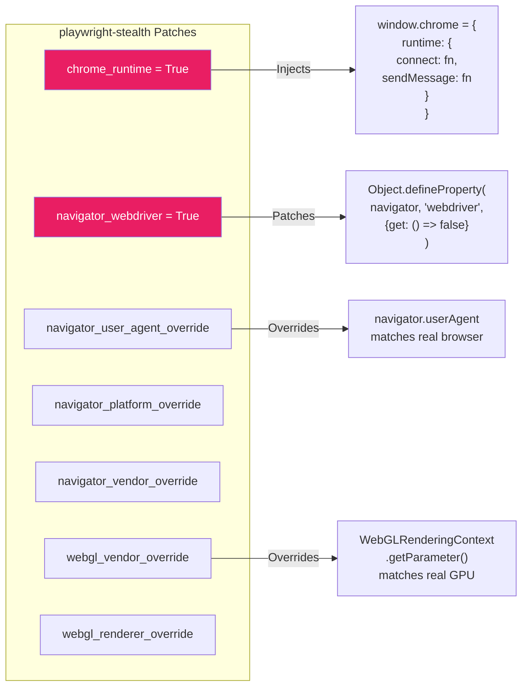

### Detection Tests Bypassed

| Test                              | Without Stealth |      With Stealth       |
| --------------------------------- | :-------------: | :---------------------: |
| `navigator.webdriver`             |    `true` ❌    |       `false` ✅        |
| `window.chrome`                   | `undefined` ❌  |  `{runtime: {...}}` ✅  |
| `window.chrome.runtime`           | `undefined` ❌  | `{connect: fn, ...}` ✅ |
| WebGL renderer fingerprint        |  Mismatched ❌  |   Matches real GPU ✅   |
| `navigator.userAgent` consistency |   Generic ❌    |    Real Chrome UA ✅    |

---

## 6. Technique 4: Extended Fingerprint Injection (JavaScript)

### What It Does

Injects custom JavaScript via `context.add_init_script()` to override navigator properties that `playwright-stealth` does not cover.

### Why It Matters

`playwright-stealth` covers the most common detection vectors, but reCAPTCHA also checks less common properties like `hardwareConcurrency`, `deviceMemory`, and `maxTouchPoints`. Inconsistencies in these values can reduce the score.

### How It's Implemented

**File:** `src/stealth.py` → `_extra_fingerprint_script()` (lines 88–123)  
**File:** `src/helpers/stealth.py` → `_extra_fingerprint_script()` (lines 84–119)

```python
def _extra_fingerprint_script(fp: dict | None) -> str:
    overrides = []

    # Hardware concurrency (CPU cores)
    hc = fp.get("hardwareConcurrency")
    if hc:
        overrides.append(
            f"Object.defineProperty(navigator, 'hardwareConcurrency', "
            f"{{get: () => {hc}}});"
        )

    # Device memory (RAM in GB)
    dm = fp.get("deviceMemory")
    if dm:
        overrides.append(
            f"Object.defineProperty(navigator, 'deviceMemory', "
            f"{{get: () => {dm}}});"
        )

    # Max touch points (0 for desktop, >0 for mobile)
    mtp = fp.get("maxTouchPoints", 0)
    overrides.append(
        f"Object.defineProperty(navigator, 'maxTouchPoints', "
        f"{{get: () => {mtp}}});"
    )

    # Languages array
    langs = fp.get("languages")
    if langs:
        overrides.append(
            f"Object.defineProperty(navigator, 'languages', "
            f"{{get: () => {json.dumps(langs)}}});"
        )

    return "\n".join(overrides)
```

This script runs **before any page JavaScript** via `context.add_init_script()`, ensuring reCAPTCHA's detection scripts see consistent values from the first moment.

### Example Generated Script

For the recorded fingerprint in `outputs/fingerprint.json`:

```javascript
Object.defineProperty(navigator, "hardwareConcurrency", { get: () => 8 });
Object.defineProperty(navigator, "deviceMemory", { get: () => 8 });
Object.defineProperty(navigator, "maxTouchPoints", { get: () => 0 });
Object.defineProperty(navigator, "languages", { get: () => ["en-US", "en"] });
```

---

## 7. Technique 5: Human Behavior Simulation

### What It Does

Simulates realistic mouse movements, scrolling, clicking, and dwell time to produce behavioral signals that match human interaction patterns.

### Why It Matters

reCAPTCHA v3 heavily weights **behavioral analysis**. A bot that navigates directly to a button and clicks it in 100ms will score `0.1`. A session with natural mouse movement, scroll exploration, and appropriate dwell time scores `0.7–0.9`.

### How It's Implemented

**Sync path:** `src/human.py` (75 lines)  
**Async path:** `src/helpers/async_human.py` (44 lines)  
**Orchestrator:** `src/core.py` → `_simulate_human_behavior()` (lines 91–96)

#### Mouse Movements

```python
def random_mouse_movements(page: Page, count: int = 5) -> None:
    viewport = page.viewport_size
    for _ in range(count):
        x = random.randint(100, viewport["width"] - 100)
        y = random.randint(100, viewport["height"] - 100)
        # Multiple steps create a curved path, not a teleport
        page.mouse.move(x, y, steps=random.randint(3, 8))
        time.sleep(random.uniform(0.05, 0.2))
```

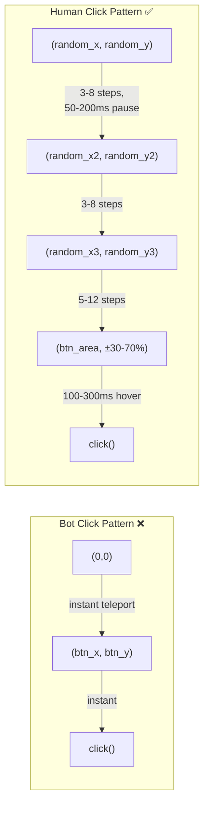

#### Scroll Simulation

```python
def random_scroll(page: Page) -> None:
    # Scroll DOWN in small increments (2-4 times)
    for _ in range(random.randint(2, 4)):
        scroll_amount = random.randint(80, 200)
        page.mouse.wheel(0, scroll_amount)
        time.sleep(random.uniform(0.2, 0.5))

    time.sleep(random.uniform(0.3, 0.8))  # Pause at bottom

    # Scroll BACK UP (1-3 times)
    for _ in range(random.randint(1, 3)):
        scroll_amount = random.randint(80, 200)
        page.mouse.wheel(0, -scroll_amount)
        time.sleep(random.uniform(0.2, 0.5))
```

#### Human-Like Click (`human_click`)

```python
def human_click(page: Page, selector: str) -> None:
    element = page.locator(selector)
    box = element.bounding_box()

    if box:
        # Click at a RANDOM point within the element (not dead center)
        target_x = box["x"] + box["width"] * random.uniform(0.3, 0.7)
        target_y = box["y"] + box["height"] * random.uniform(0.3, 0.7)

        # Multi-step approach movement
        page.mouse.move(target_x, target_y, steps=random.randint(5, 12))

        # Hover pause before clicking (humans don't click instantly)
        time.sleep(random.uniform(0.1, 0.3))

        page.mouse.click(target_x, target_y)
```

### Behavioral Signal Timeline

```mermaid
gantt
    title Human Behavior Simulation Timeline
    dateFormat X
    axisFormat %Ls

    section Warm-Up Phase
    Google visit                    :a1, 0, 1500
    Mouse movements (2x)           :a2, 1500, 1900

    section Target Page
    Navigate to target              :b1, 1900, 3900
    Mouse movements (3x)           :b2, 3900, 4800
    Random scroll (down + up)      :b3, 4800, 6200
    Dwell time (2.0-3.5s)          :b4, 6200, 9200

    section Interaction
    Approach #btn (5-12 steps)     :c1, 9200, 9600
    Hover pause                    :c2, 9600, 9900
    Click                          :c3, 9900, 10000
    Wait for result                :c4, 10000, 12000
```

### Randomization Ranges

| Action           |  Min |  Max | Unit  |
| ---------------- | ---: | ---: | ----- |
| Mouse move steps |    3 |   12 | steps |
| Inter-move pause |   50 |  200 | ms    |
| Scroll amount    |   80 |  200 | px    |
| Scroll pause     |  200 |  500 | ms    |
| Bottom pause     |  300 |  800 | ms    |
| Pre-click hover  |  100 |  300 | ms    |
| Dwell time       | 2000 | 3500 | ms    |
| Warm-up dwell    |  800 | 1500 | ms    |

---

## 8. Technique 6: Google Warm-Up (Trust Signal Building)

### What It Does

Before navigating to the reCAPTCHA-protected target page, the system first visits `google.com`, performs mouse movements, and dwells briefly. This establishes a trusted session context.

### Why It Matters

reCAPTCHA v3 is **Google's product**. It has deep integration with Google's cookie/session infrastructure. A browser session that has recently interacted with Google's domain is inherently more trusted. Sessions that arrive "cold" to a reCAPTCHA-protected page with no prior Google interaction are suspicious.

### How It's Implemented

**File:** `src/core.py` → `_perform_warmup()` (lines 79–88)

```python
def _perform_warmup(page: Page):
    """Visit Google to establish a trusted session context."""
    try:
        page.goto(GOOGLE_URL, wait_until="domcontentloaded", timeout=60000)
        page.wait_for_timeout(random.randint(800, 1500))
        random_mouse_movements(page, count=2)
    except Exception as e:
        print(f"  ⚠️  Warm-up failed (non-critical): {e}")
```

### Trust Building Flow

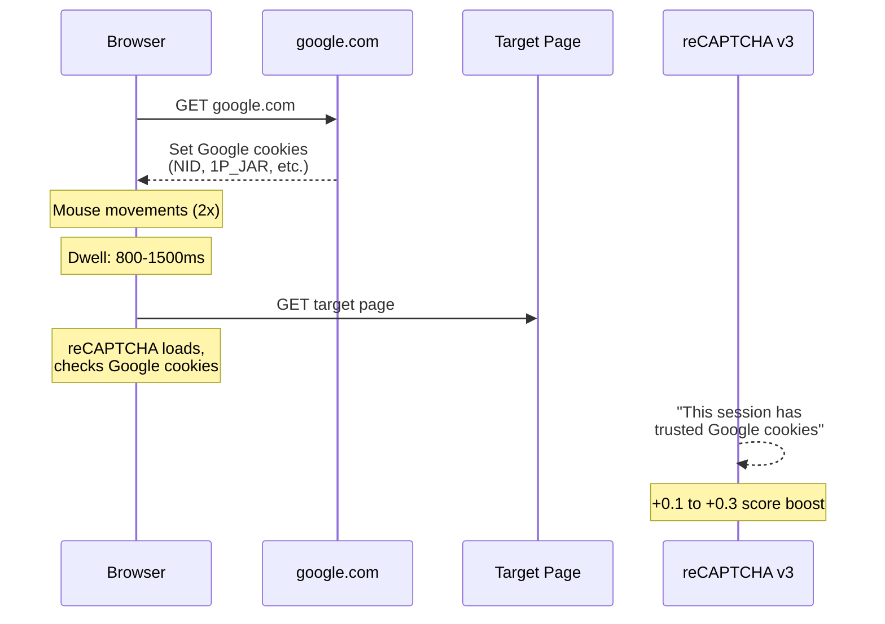

### Error Handling

The warm-up is wrapped in a `try/except` with suppressed errors because:

- Warm-up failure should **not** abort the test
- Network issues (DNS, timeout) are common but non-critical
- The test can still succeed with a slightly lower score without warm-up

---

## 9. Technique 7: Persistent Chrome Profile

### What It Does

Chrome is launched with a `--user-data-dir` pointing to `.chrome_profile/`, which persists cookies, local storage, IndexedDB, and Chrome's internal state across runs.

### Why It Matters

reCAPTCHA tracks session history. A browser with existing Google cookies, cached data, and a normal browsing history looks far more legitimate than a fresh, empty profile.

### How It's Implemented

**File:** `config/settings.py` (line 8)

```python
PROFILE_DIR = os.path.join(PROJECT_ROOT, ".chrome_profile")
```

**File:** `src/stealth.py` (line 209)

```python
chrome_args = [
    chrome_binary,
    f"--user-data-dir={PROFILE_DIR}",   # ← Persistent profile
    ...
]
```

### What Gets Persisted

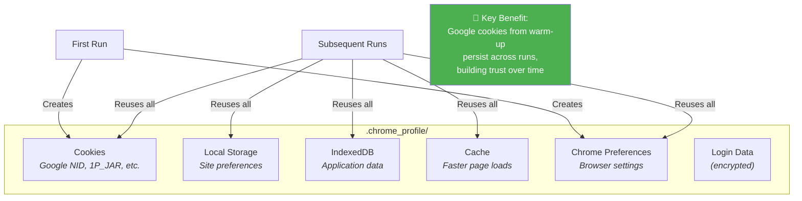

---

## 10. Technique 8: Token Interception via Route Handling

### What It Does

Intercepts the outgoing POST request that contains the reCAPTCHA token **before** it reaches the server, allowing the system to capture the token for analysis without modifying the page's JavaScript.

### Why It Matters

The reCAPTCHA token is generated client-side by `grecaptcha.execute()` and sent via `fetch()` as `multipart/form-data`. Intercepting it at the network layer (via Playwright's route API) is non-invasive — it doesn't inject any JavaScript that could be detected.

### How It's Implemented

**File:** `src/interceptor.py` → `TokenInterceptor` class (46 lines)

```python
class TokenInterceptor:
    def __init__(self):
        self.token: str | None = None

    def attach(self, page: Page, target_url: str) -> None:
        page.route(target_url, self._handle_route)

    def _handle_route(self, route: Route) -> None:
        request = route.request
        if request.method == "POST" and request.post_data:
            body = request.post_data
            # Parse multipart/form-data to extract token
            match = re.search(
                r'name="token"\r?\n\r?\n(.+?)(?:\r?\n--)', body, re.DOTALL
            )
            if match:
                self.token = match.group(1).strip()
            else:
                # Fallback: URL-encoded form
                for part in body.split("&"):
                    if part.startswith("token="):
                        self.token = part[len("token="):]
        route.continue_()  # ← Always continues the request
```

### Interception Flow

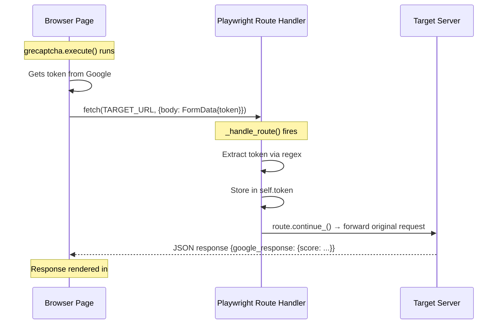

### Why Not Inject JavaScript?

| Approach                              | Pros                                                        | Cons                                      |
| ------------------------------------- | ----------------------------------------------------------- | ----------------------------------------- |
| **Route interception** (our approach) | Non-invasive, no JS footprint, handles all encoding formats | Requires regex parsing of multipart data  |
| **JS injection** (`page.evaluate`)    | Simpler parsing                                             | Modifies JS context, possibly detected    |
| **Response interception**             | Can modify response                                         | Changes server behavior, breaks integrity |

---

## 11. Technique 9: Proxy Support with Auth Extension

### What It Does

Supports HTTP proxy servers with authentication by dynamically creating a Chrome extension that handles the `407 Proxy Authentication Required` challenge. This avoids the authentication popup that Chrome shows for proxies with credentials.

### Why It Matters

Using multiple proxies allows:

- **IP rotation** to avoid rate limiting
- **Geographical diversity** for more realistic traffic patterns
- Testing from different network conditions

Chrome's built-in `--proxy-server` flag does not support `username:password` authentication, so maintaining a seamless proxy auth requires this extension approach.

### How It's Implemented

**File:** `src/async_manager.py` → `AsyncBrowserManager._create_proxy_auth_extension()` (lines 35–116)

```python
def _create_proxy_auth_extension(self, proxy_url: str) -> str:
    # Parse proxy URL for credentials
    parsed = urlparse(proxy_url)
    username = parsed.username
    password = parsed.password
    host = parsed.hostname
    port = parsed.port

    # Create a temporary Chrome extension directory
    ext_dir = os.path.join(PROFILE_DIR, "proxy_auth_ext")

    # manifest.json — declares permissions for proxy + webRequest
    # background.js — intercepts auth challenges and responds automatically
```

The extension uses Chrome's `webRequest.onAuthRequired` API to automatically supply credentials when the proxy challenges the connection.

### Proxy Validation

Before using a proxy for a batch of runs, it's validated using `curl`:

```python
async def _validate_proxy(self, proxy):
    proc = await asyncio.create_subprocess_exec(
        "curl", "--max-time", "5", "-I", "-x", proxy,
        "https://www.google.com",
        stdout=asyncio.subprocess.DEVNULL,
        stderr=asyncio.subprocess.DEVNULL,
    )
    await proc.wait()
    return proc.returncode == 0
```

---

## 12. Technique 10: Process Lifecycle Hygiene

### What It Does

Ensures clean Chrome process management across runs by killing stale processes, removing lock files, and waiting for port availability before connecting.

### Why It Matters

Leftover Chrome processes from crashed or interrupted runs can:

- Block the debugging port
- Corrupt the Chrome profile (lock files)
- Cause "Target page, context or browser has been closed" errors
- Lead to resource exhaustion over many iterations

### How It's Implemented

**File:** `src/stealth.py` → `_kill_existing_chrome()` (lines 138–166)  
**File:** `src/stealth.py` → `_wait_for_port()` (lines 169–179)

```python
def _kill_existing_chrome(debug_port: int) -> None:
    # 1. Kill by port (lsof + kill -9)
    result = subprocess.run(
        ["lsof", "-ti", f":{debug_port}"],
        capture_output=True, text=True,
    )
    if result.stdout.strip():
        for pid in result.stdout.strip().split("\n"):
            subprocess.run(["kill", "-9", pid], capture_output=True)

    # 2. Kill by process name pattern
    subprocess.run(
        ["pkill", "-f", f"remote-debugging-port={debug_port}"],
        capture_output=True,
    )
    time.sleep(1)

    # 3. Remove stale Chrome lock files
    for lock_file in ["SingletonLock", "SingletonSocket", "SingletonCookie"]:
        lock_path = os.path.join(PROFILE_DIR, lock_file)
        try:
            os.remove(lock_path)
        except FileNotFoundError:
            pass
```

### Cleanup Sequence

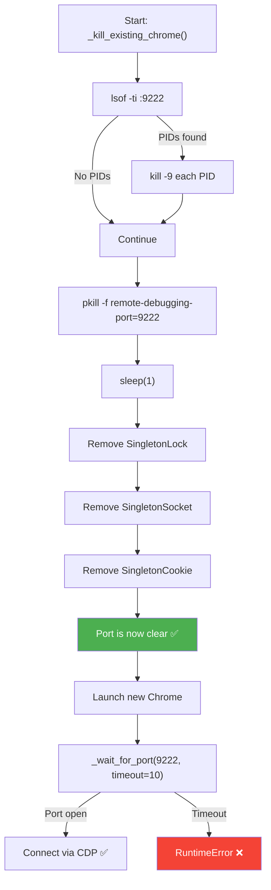

---

## 13. Technique Stack Diagram

This shows how all 10 techniques work together in a single execution:

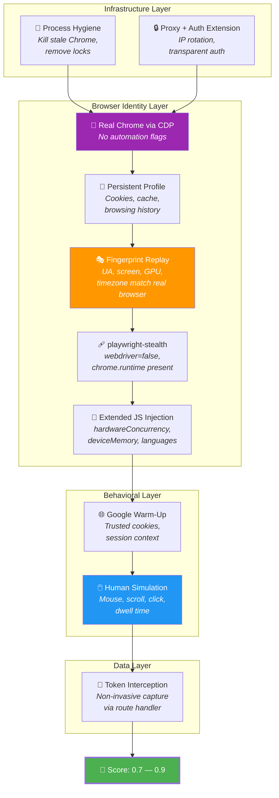

---

## 14. Score Impact Analysis

Each technique contributes to the final reCAPTCHA v3 score. While Google does not publish the exact weights, empirical testing shows the following approximate impact:

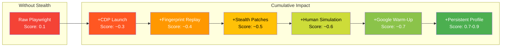

### Technique Impact Summary

| Technique             | Category       | Approx. Score Impact | Risk if Missing                  |
| --------------------- | -------------- | :------------------: | -------------------------------- |
| Real Chrome via CDP   | Identity       |       **+0.2**       | Instant `0.1` score (detected)   |
| Fingerprint Replay    | Identity       |       **+0.1**       | Inconsistency flags              |
| playwright-stealth    | Identity       |       **+0.1**       | `webdriver=true` detection       |
| Extended JS Injection | Identity       |      **+0.05**       | Minor inconsistency flags        |
| Human Behavior Sim    | Behavioral     |     **+0.1–0.2**     | Bot-like interaction pattern     |
| Google Warm-Up        | Session        |     **+0.1–0.3**     | No trusted session context       |
| Persistent Profile    | Session        |    **+0.05–0.1**     | Cold session penalty             |
| Token Interception    | Data           |       **N/A**        | _Capture mechanism, not scoring_ |
| Proxy Support         | Infrastructure |      **Varies**      | IP reputation dependent          |
| Process Hygiene       | Infrastructure |       **N/A**        | _Reliability, not scoring_       |

> **Note:** These are empirical estimates from testing. Actual impact varies based on IP reputation, time of day, target site configuration, and Google's evolving detection algorithms.

### Key Insight: Defense in Depth

No single technique achieves a high score alone. The system's strength comes from the **combination** of all techniques working together, creating a browser session that is indistinguishable from a real human user across every detection vector that reCAPTCHA v3 examines.
