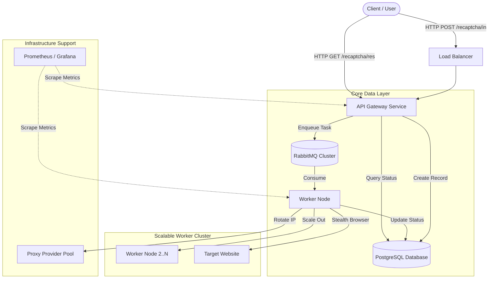

# Task 4: Production Architecture Design

This document maps the current local simulation (Task 1-3) to a scalable, distributed production request.

## 1. Production Architecture Diagram

## 2. Local → Production Component Mapping

| Local Component (Current Code) | Production Component (Architecture) | Rationale |
| :--- | :--- | :--- |
| **`asyncio.Queue`** (in `state.py`) | **RabbitMQ** or **AWS SQS** | Decouples API from Workers; handles message persistence and delivery guarantees. |
| **`JobStore (Dict)`** (in `state.py`) | **PostgreSQL** or **Redis** | Persists task state across restarts; allows querying by external services. |
| **`worker_loop`** (in `worker.py`) | **Kubernetes Pods** | Independent scaling logic. Code logic remains identical, just wrapped in a service. |
| **`sem` (Semaphore)** | **HPA (Horizontal Pod Autoscaler)** | Local concurrency limit becomes cluster-wide scaling limit managed by K8s. |
| **`simulation.py`** | **Internal Service / Client** | The script mimics an upstream service that needs the captcha token. |
| **`logging.print`** | **ELK Stack / Datadog** | Centralized logging for distributed debugging. |

## 3. Scalability & Failure Strategy

### Horizontal Scaling
*   **Metric-Driven Scaling**: Scale Worker Pods based on **Queue Length** (RabbitMQ depth). If queue > 1000, add more pods.
*   **Statelessness**: The `Worker` implementation (Task 1 logic) is stateless. It pulls a task, solves it, and updates DB. This allows infinite horizontal scaling.

### Failure Handling
*   **Retries**: Use RabbitMQ **Dead Letter Exchanges (DLX)**. If a worker crashes or validation fails (e.g., Score < 0.1), negative-ack the message to retry later with backoff.
*   **Browser Crashes**: The current `AsyncBrowserManager` restart logic (Task 2) handles local failures. In production, K8s liveness probes will restart the entire pod if the browser becomes unresponsive.
*   **Proxy Failures**: Integrate **Proxy Rotation Middleware**. If a proxy is blocked (403/429), the request is retried with a new proxy IP before marking the task as failed.

### Monitoring
*   **Health Checks**: `/health` endpoint on API and Worker.
*   **Alerting**: Alert on high `JobStatus.FAILED` rates or Queue Latency > 30s.
